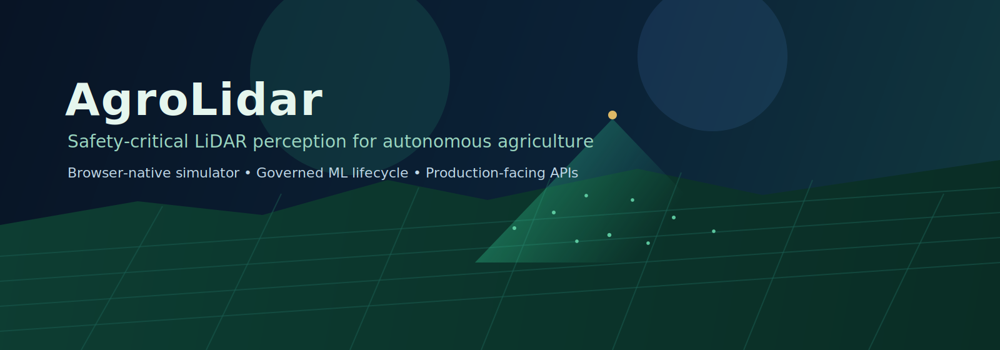

<p align="center">
  
</p>

<h1 align="center">AgroLidar</h1>

<p align="center"><strong>Field-ready LiDAR perception for agricultural autonomy.</strong><br/>A safety-focused platform that combines a browser-native simulator, governed model lifecycle, and production-facing inference services.</p>

<p align="center">
  <a href="/simulator"><strong>Launch Simulator</strong></a> •
  <a href="docs/index.md"><strong>Documentation</strong></a> •
  <a href="docs/architecture.md"><strong>Architecture</strong></a> •
  <a href="docs/roadmap.md"><strong>Roadmap</strong></a>
</p>

<p align="center">
  <a href="https://github.com/AgroLidar/AgroLidar/actions/workflows/ci.yml"></a>
  <a href="https://github.com/AgroLidar/AgroLidar/actions/workflows/security.yml"></a>
  <a href="https://github.com/AgroLidar/AgroLidar/actions/workflows/docs.yml"></a>
  <a href="https://github.com/AgroLidar/AgroLidar/actions/workflows/release.yml"></a>
  <a href="https://github.com/AgroLidar/AgroLidar/actions/workflows/codeql.yml"></a>
</p>

<p align="center">
  
  
  
  
</p>

---

## What AgroLidar Is

AgroLidar is a full-stack agricultural LiDAR perception platform designed for safety-critical machine operations. It brings together synthetic/field data workflows, training and retraining pipelines, safety-gated model promotion, and inference serving—plus a browser-native flagship simulator that makes the perception story tangible from the first minute.

## The Problem → The Opportunity

Field autonomy is difficult because agricultural environments are dynamic, unstructured, and safety-sensitive: terrain shifts, dust and occlusion are common, and humans/animals/vehicles can appear unexpectedly.

Most teams end up with fragmented tools—one stack for data, another for models, another for demos, and brittle handoffs between them.

**AgroLidar unifies this into one governed system**:
- simulation and scenario exploration,
- perception model lifecycle,
- safety checks before promotion,
- and production-oriented API surfaces.

That shortens iteration loops while preserving safety and traceability.

## Why AgroLidar

- **Simulator-first product experience**: the web app root redirects to `/simulator`, making perception behavior immediately explorable.
- **Safety-governed lifecycle**: candidate vs production comparison and explicit safety gating before model promotion.
- **Operationally grounded architecture**: FastAPI serving, ONNX export/validation, model registry state, and platform configs for agricultural vehicles.
- **Built for real deployment conversations**: docs for operations, commissioning, safety limitations, API integration, and deployment.

---

## Flagship Simulator Experience

<p align="center">
  
</p>

AgroLidar is not only a backend ML repository. It includes a browser-native simulator experience built with Next.js + React Three Fiber so teams can demo and evaluate mission behavior visually.

**Simulator highlights**
- Root web route redirects to the simulator (`/` → `/simulator`).
- Two mission platforms in one world state: **Tractor** and **Agro Drone**.
- Drone mission profiles: **Spray**, **Spread**, **Lift**, **LiDAR Survey**.
- Telemetry surfaces: HUD, mission overlays, minimap, LiDAR rendering modes.
- Mission/parcel operations layer with sensor presets and JSON run export for evaluation workflows.
- Presentation controls including a 4K-oriented quality mode.

**Run it locally**
```bash
npm ci
npm run dev
# open http://localhost:3000
```

---

## Core Capabilities

### 1) Agricultural LiDAR Perception Stack
- Python package for data handling, preprocessing, models, training, evaluation, and risk scoring.
- Modular core in `lidar_perception/` with dedicated subsystems for model, inference, evaluation, registry, and simulation utilities.

### 2) Governed Model Lifecycle
- End-to-end scripts for train/retrain/evaluate/compare/safety-check/promote.
- Promotion workflow persists registry state in `outputs/registry/registry.json`.
- Regression reporting, hard-case mining, and review queue workflows included.

### 3) Inference & Integration Surfaces
- FastAPI inference server in `inference_server/`.
- API docs and integration guides in `docs/`.
- ONNX export and validation scripts for runtime portability.

### 4) Product-Ready Developer Experience
- Next.js App Router frontend with simulator and legacy marketing route.
- Makefile targets for repeatable local workflows.
- CI/security/docs/release workflows in GitHub Actions.

---

## System Architecture

<p align="center">
  
</p>

**Lifecycle flow**

```text
Data generation/collection
  -> Train / Retrain
  -> Evaluate
  -> Compare (candidate vs production)
  -> Safety gate
  -> Promote + Registry update
  -> Deploy / Serve inference
```

Primary reference: [`docs/architecture.md`](docs/architecture.md).

Simulator architecture deep-dive: [`docs/simulator-architecture.md`](docs/simulator-architecture.md).

---

## Technology Stack

**Perception & ML (Python)**
- PyTorch, NumPy, Pydantic, FastAPI, Uvicorn
- MLflow support, ONNX/ONNX Runtime tooling, BentoML integration

**Web & Simulator (TypeScript)**
- Next.js 16 App Router, React 19
- React Three Fiber / Drei / Three.js
- Zustand state management, Framer Motion, Tailwind CSS

**Quality, Governance, Operations**
- Pytest + coverage, Ruff, MyPy (strict targets)
- GitHub Actions for CI, docs validation/pages, release, security, and CodeQL
- Structured docs set for architecture, safety, operations, deployment, and roadmap

---

## Repository Map

```text
AgroLidar/
├── app/                      # Next.js app router surfaces (simulator, legacy page)
├── components/               # UI + simulator components
├── lib/sim/                  # Simulator world, vehicle, LiDAR, loop, scenarios
├── lidar_perception/         # Core ML/perception package
├── inference_server/         # FastAPI inference service
├── scripts/                  # Pipeline and ops command adapters
├── configs/                  # YAML configuration, including platform and safety policy
├── docs/                     # Product, architecture, safety, API, and ops docs
├── tests/                    # Python + simulator test coverage
└── outputs/                  # Reports, candidates, and registry state
```

---

## Getting Started

### Prerequisites
- Python `>=3.11,<3.14`
- Node.js (for Next.js app)

### 1) Install dependencies
```bash
python -m venv .venv
source .venv/bin/activate
pip install -r requirements.txt
npm ci
```

### 2) Verify environment
```bash
make check-install
```

### 3) Run core services
```bash
# simulator/frontend
npm run dev

# inference API (separate shell)
make serve
```

### 4) Run quality checks
```bash
make lint
make test
npm run lint
npm run typecheck
```

---

## Demo-to-Deployment Workflow

```text
Simulate / Collect
  -> Train or Retrain candidate model
  -> Evaluate + compare against production
  -> Run safety gate
  -> Promote through registry
  -> Serve via API / export to ONNX
```

Useful commands:

```bash
make generate-data
make train
make evaluate
make compare
make safety-check
make promote
make export-onnx
make validate-onnx
```

---

## Roadmap

- **Near-term (0.10.x):** denser scene benchmarks, stronger observability, tighter platform config validation, and better dangerous-class recall stability.
- **Mid-term (0.11.x):** dataset versioning metadata, deployment profiles for edge accelerators, broader promotion/rollback integration tests.
- **1.0.0 readiness:** stable API/artifact contracts, hardened enterprise operations docs, formal release/deprecation policy, expanded safety assurance evidence.

See: [`docs/roadmap.md`](docs/roadmap.md).

---

## Build With Us

### For Developers
- Contribution guide: [`CONTRIBUTING.md`](CONTRIBUTING.md)
- Development docs: [`docs/development.md`](docs/development.md)
- API reference: [`docs/api-reference.md`](docs/api-reference.md)

### For Evaluators & Operators
- Architecture: [`docs/architecture.md`](docs/architecture.md)
- Operations manual: [`docs/OPERATIONS_MANUAL.md`](docs/OPERATIONS_MANUAL.md)
- Safety and limitations: [`docs/SAFETY_AND_LIMITATIONS.md`](docs/SAFETY_AND_LIMITATIONS.md)
- Installation and commissioning: [`docs/INSTALLATION_AND_COMMISSIONING.md`](docs/INSTALLATION_AND_COMMISSIONING.md)

### Trust & Governance
- Security policy: [`SECURITY.md`](SECURITY.md)
- Security notes: [`SECURITY_NOTES.md`](SECURITY_NOTES.md)
- Release notes: [`RELEASE_NOTES.md`](RELEASE_NOTES.md)
- Changelog: [`CHANGELOG.md`](CHANGELOG.md)
- License: [`LICENSE`](LICENSE)

---

## Final Call

If you want to evaluate agricultural LiDAR perception as a product—not just as disconnected scripts—start with the simulator, inspect the architecture, and walk the governed model lifecycle end-to-end.

**Explore now:** [`/simulator`](/simulator) · [`docs/index.md`](docs/index.md) · [`docs/architecture.md`](docs/architecture.md)
