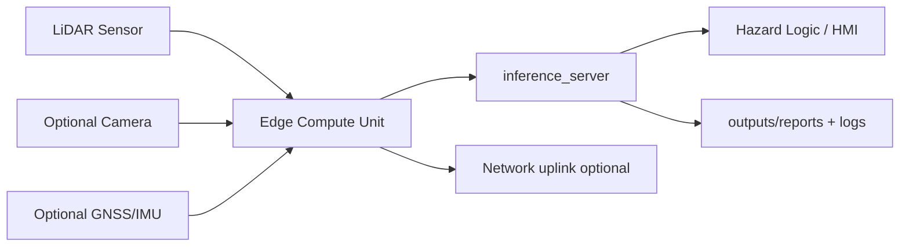

# Hardware Deployment Guide

> Indicative values and architectures only. Performance numbers are targets, not validated benchmarks.

## 1. System Overview

## 2. Required Hardware
- LiDAR sensor capable of stable field operation.
- Edge compute (x86 or ARM) that can run Python + PyTorch/ONNX runtime.
- Power conditioning and fused supply.
- Weather-protected mounting and cable management.
- Persistent storage for logs and model artifacts.

## 3. Optional Hardware
- RGB camera for operator visibility overlays (not required by current model input).
- GNSS/IMU for geo-tagging and future localization fusion.
- Operator HMI / buzzer stacklight integration.
- External logging SSD and cellular modem.

## 4. Reference Hardware Tiers

| Tier | Typical use | Compute | Notes |
|---|---|---|---|
| Prototype / Lab | Algorithm iteration | Laptop CPU / desktop CPU | Indoor/dev validation only |
| Pilot / Field Validation | Real vehicle pilot | Jetson Orin class | Edge-ready with thermal design |
| Production-Oriented / OEM-ready | Program scale-up | Industrial SOM + rugged I/O | Requires OEM integration + certification |

## 5. BOM Guidance

| Component | Why it matters | Minimum requirement | Recommended spec | Notes |
|---|---|---|---|---|
| LiDAR sensor | Primary perception source | Stable point returns, known calibration | Automotive/industrial grade, weather rated | Validate vendor certs directly |
| Compute unit | Runs BEV inference | 4+ cores, 16 GB RAM | GPU-capable edge module | Match `configs/server.yaml` device/backend |
| Camera (optional) | Operator context | 720p | 1080p global shutter | Not used in BEV model input today |
| Storage | Logs/checkpoints | 128 GB SSD | 512 GB NVMe | Preserve artifacts in `outputs/` |
| Networking | API access/telemetry | Ethernet | Dual Ethernet + LTE fallback | API is currently unauthenticated |
| Power/DC-DC | Availability/stability | Regulated 12V/24V | Surge-protected isolated converter | Include fusing and transient suppression |
| Mounting hardware | Sensor stability | Rigid bracket | Anti-vibration isolated mount | Recalibrate after mount changes |
| Enclosure/thermal | Uptime | Splash resistant | IP65+ with active/passive thermal design | Avoid thermal throttling |
| GNSS/IMU (optional) | Future fusion/logging | NMEA/IMU output | RTK-capable + calibrated IMU | Optional in current software |
| Operator HMI (optional) | Human alerting | Audible/visual alert | Integrated display + alarm outputs | Integrator-owned safety chain |
| Logging hardware | Audit trail | Local disk | Removable encrypted SSD | Align with retention policy |

## 6. Environmental Requirements
- Target enclosure rating: IP65 or better for external modules.
- Operating temperature target: follow sensor/compute vendor ratings; validate seasonal extremes.
- High vibration platforms need isolation mounts and locking connectors.
- Dust and mud contamination mitigation required (cleaning schedule + guards).

## 7. Mounting Geometry Guidance
- Typical mounting height: 1.4 m to 3.2 m depending on platform profile.
- Use slight negative pitch (about -1° to -5°) to include near-ground hazard zone.
- Keep consistent centerline alignment where possible (lateral offset near 0 m).
- Avoid occlusions from booms, headers, implements, and exhaust stacks.

## 8. Cable and Connector Recommendations
- Prefer M12/M8 locking connectors for sensor and industrial I/O paths.
- Use shielded cable for power and data when routed near high-current lines.
- Aviation connectors can be used for serviceable modular harnesses.
- Add strain relief and abrasion protection near articulation points.

## 9. EMI and Power Stability
- Separate sensor/data harness from alternator/starter harnesses where possible.
- Use DC-DC modules with surge and reverse-polarity protection.
- Verify stable rail under load transients (startup, fan cycles, hydraulic events).
- Monitor compute throttling and undervoltage events in pilot logs.

## 10. Latency / Performance Reference (Indicative)

| Tier | Compute | Inference ms | FPS | Notes |
|---|---|---:|---:|---|
| Prototype | Laptop CPU | ~80-150ms | 6-12 | Dev/lab only |
| Pilot | Jetson Orin | ~25-50ms | 20-40 | Field ready |
| Production | Custom SOM | <20ms | 50+ | OEM target |
