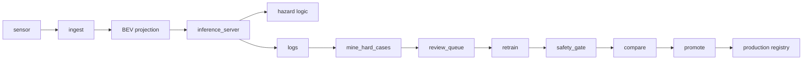
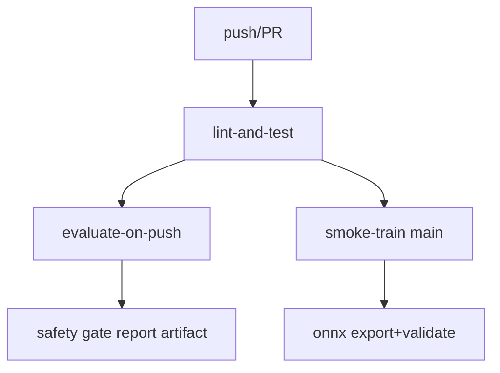
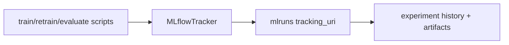
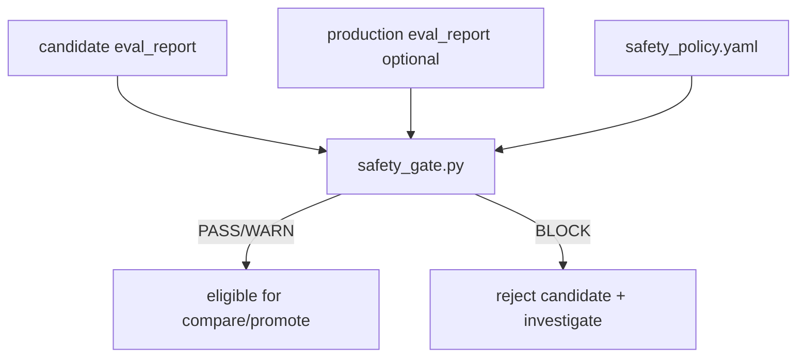

# Reference Architectures

## 1. End-to-End Data Flow

## 2. Deployment Modes
- Offline evaluation workstation: training/evaluation only.
- Edge inference on vehicle: `inference_server/` + checkpoint.
- Edge + cloud retraining: edge logs + offline review/retrain/gate/promotion.

## 3. Repository Component Mapping
- `scripts/`: train/retrain/evaluate/gate/promote and utilities.
- `configs/`: runtime, safety, mining, server, platform profiles.
- `outputs/`: checkpoints, reports, registry, ONNX artifacts.
- `inference_server/`: FastAPI serving stack.
- `lidar_perception/`: core model/data/evaluation code.
- `app/`: landing site (Next.js).
- `tests/`: unit/integration tests.
- `mlruns/`: MLflow tracking artifacts.

## 4. GitHub Actions CI/CD Flow

## 5. MLflow Tracking Integration

## 6. Safety Gate Decision Flow

